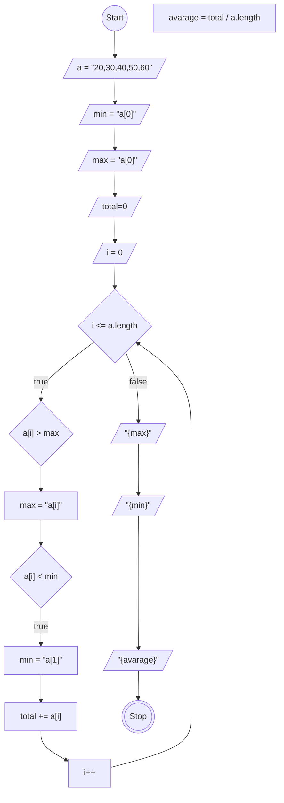

# Javascript 2

## lowchart Hitung nilai Max, Min, dan Avarage

```mermaid
flowchart TD

a@{shape: circle , label : "Start"}
b@{shape: lean-r, label : 'a = "20,30,40,50,60"'}
c@{shape: lean-r, label : 'min = "a[0]"'}
d@{shape: lean-r, label : 'max = "a[0]"'}
e@{shape: lean-r, label : "total=0"}
f@{shape: diamond, label : "i <= a.length"}
g@{shape: rect, label : "i++"}
h@{shape : diamond, label : "a[i] > max"}
i@{shape: rect , label : 'max = "a[i]"' }
j@{shape: diamond, label : "a[i] < min"}
k@{shape: rect, label : 'min = "a[1]"'}
l@{shape: rect, label: "total += a[i]"}
m@{shape: rect, label: "avarage = total / a.length "}
n@{shape: lean-r, label : '"{max}"'}
o@{shape: lean-r, label : '"{min}"'}
p@{shape: lean-r, label : '"{avarage}"'}
q@{shape: dbl-circ, label: "Stop"}
r@{shape: lean-r, label : "i = 0"}

a-->b
b-->c
c-->d
d-->e
e-->r
r-->f
f--true-->h
h-->i
i-->j
j--true-->k
k-->l
l-->g
g-->
f--false-->n
n-->o
o-->p
p-->q

```
